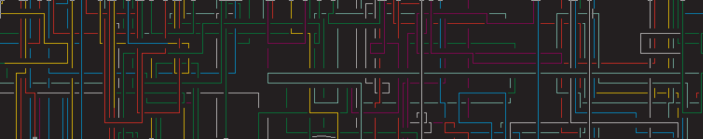

# pipes.go



## Description
A [pipes.sh](https://github.com/pipeseroni/pipes.sh) clone written in Golang. Runs faster and has less CPU usage than the original.

## Requirements
* Golang
* ncurses

## Usage
* **-C** disables color
* **-N** lets the pipes change color when exiting the screen (just like in pipes.sh)
* **-R** lets the pipes start from random coordinates
* **-p** specifies the amount of pipes
* **-r** specifies after how many updates to clear the screen
* **-f** sets the targeted frames per second
* **-s** sets the probability of not changing the direction for a pipe

## Building & Installation
```
make
```
A simple make call will install the needed library [goncurses](https://github.com/rthornton128/goncurses) and compile the program.
```
make install
```
This will build the executable and move it to */usr/local/bin*.
```
make uninstall
```
This will delete the executable from */usr/local/bin*.
